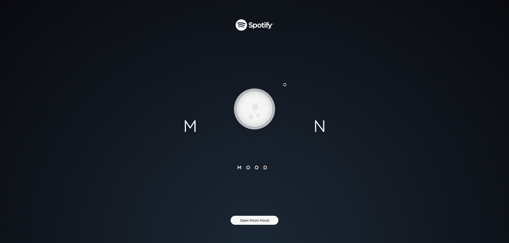
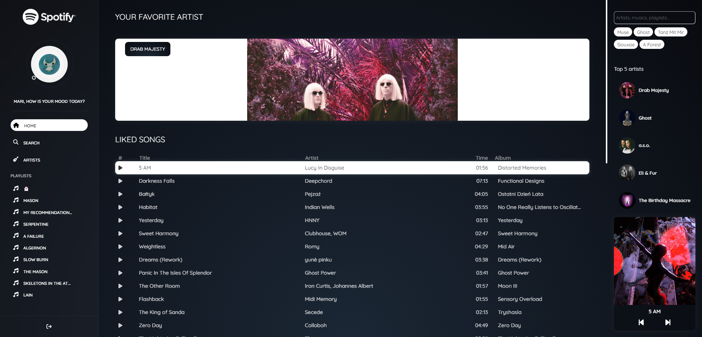
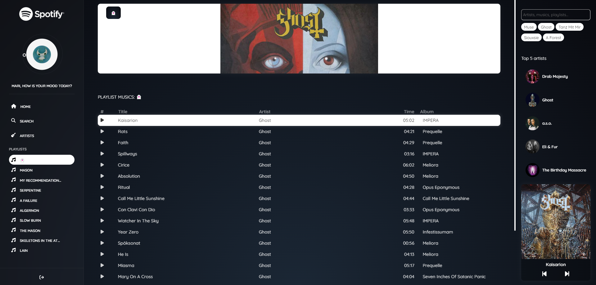

# Moon Mood - Spotify

This project was generated with [Angular CLI](https://github.com/angular/angular-cli) version 16.2.1 and the and the [Spotify API](https://developer.spotify.com/documentation/web-api). Made entirely for study purposes :)

## To do

- [ ] Mobile size
- [ ] Play and pause
- [ ] Search
- [ ] Artist page

## Development server

Run `ng serve` for a dev server. Navigate to `http://localhost:4200/`. The application will automatically reload if you change any of the source files.

## Code scaffolding

Run `ng generate component component-name` to generate a new component. You can also use `ng generate directive|pipe|service|class|guard|interface|enum|module`.

## Build

Run `ng build` to build the project. The build artifacts will be stored in the `dist/` directory.

## Help

To get more help on the Angular CLI use `ng help` or go check out the [Angular CLI Overview and Command Reference](https://angular.io/cli) page.
